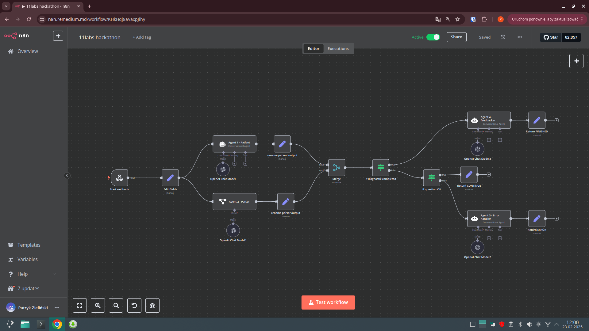
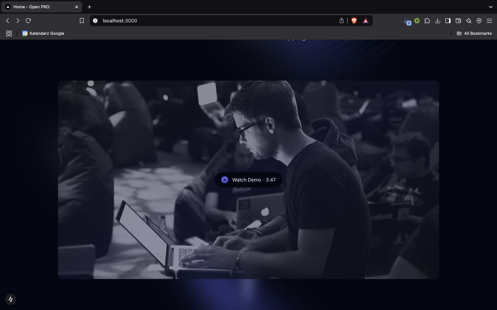
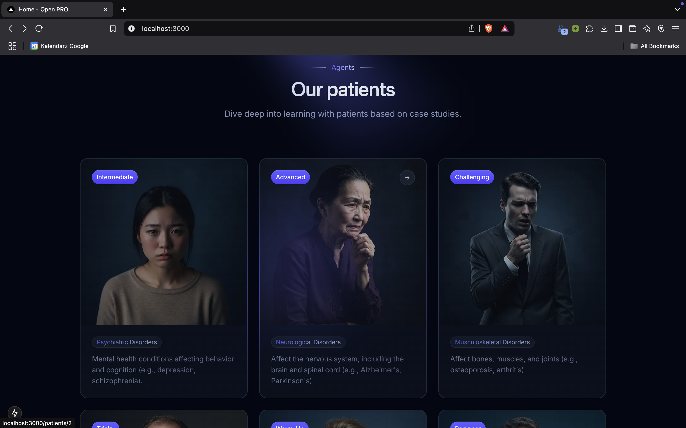
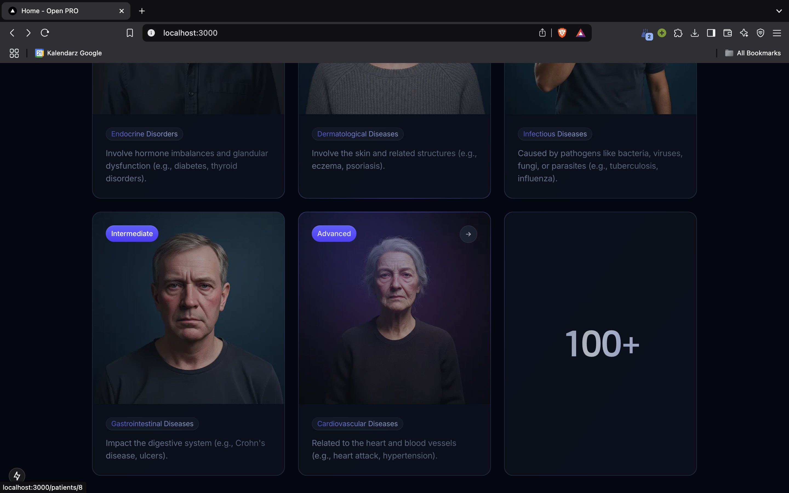
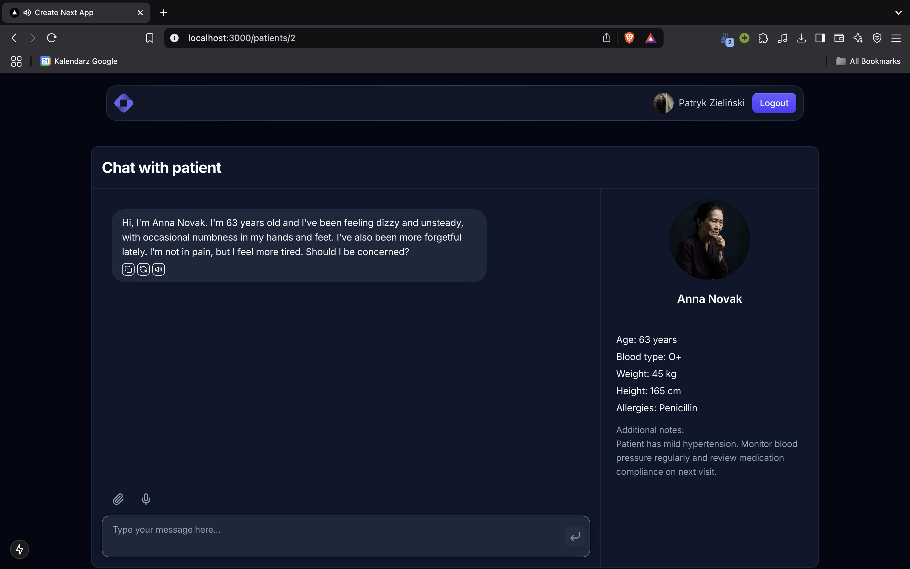
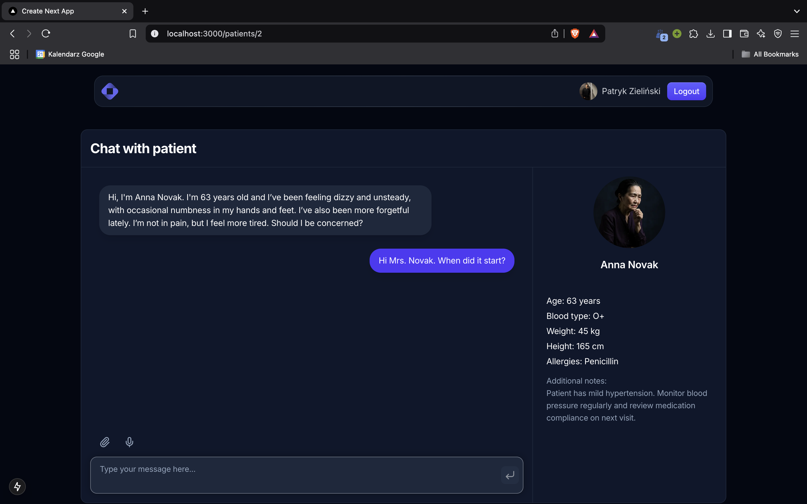

# ElevenLabs Hackathon 2025

## Description

The application helps you improve your diagnosis skills by talking (or chatting) with patients based on case studies.

## Technologies

* ElevenLabs API
* OpenAI API
* FastAPI
* n8n
* Next.js
* Tailwind CSS

## Images

## Project Overview

### Inspiration

Medical residency can be overwhelming. Despite years of theoretical study, students often feel unprepared for real-world scenarios. This gap inspired **Medju**, providing a **risk-free, immersive environment** for students to practice diagnosing and communicating with **virtual patients**.

### What it does

**Medju** enhances medical training through realistic interactions:

- **Multiple Virtual Patients:** Choose from diverse patients with unique medical cases.
- **Interactive Scenarios:** Engage in real-time conversations with AI-powered patients.
- **Data-Driven Feedback:** Receive insights on medical accuracy and soft skills.
- **Seamless Integration:** Easily fits into university curricula, enhancing training.

### How we built it

Developed using:

- **Python** for backend and **JavaScript** for frontend.
- A user-friendly interface for easy navigation.

### Challenges we ran into

Key challenges included:

- **Realistic Interactions:** Ensuring human-like responses from virtual patients.
- **Usability vs. Complexity:** Balancing a powerful platform with user-friendliness.

### What we learned

Key lessons include:

- **User-Centered Design:** Early user engagement improved intuitiveness.
- **Collaboration:** Effective teamwork was crucial for overcoming challenges.

### What's next for **Medju**

Future plans include:

- **Expanding Patient Scenarios:** Growing our library based on feedback.
- **Advanced AI Features:** Implementing context-aware conversations.
- **Broader Adoption:** Outreach to medical schools for integration.
- **Continuous Improvement:** Refining the tool based on user data.

**Medju** aims to transform medical education and lead the future of healthcare training!

## How to run

1. Clone the repository
2. Run `pnpm install`
3. Run `pnpm dev`

## Datasets

* [medical knowledge](https://huggingface.co/datasets/medalpaca/medical_meadow_wikidoc_patient_information)
* ...
