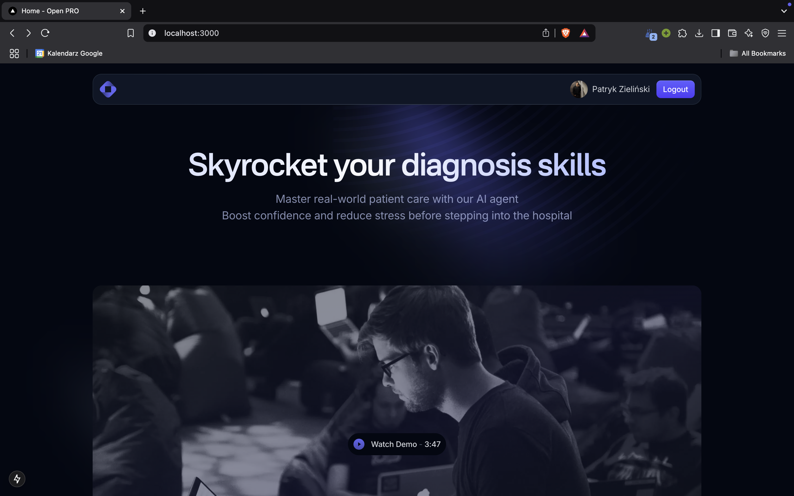

# ElevenLabs Hackathon 2025

## Description

The application helps you improve your diagnosis skills by talking (or chatting) with patients based on case studies.

## Technologies

* ElevenLabs API
* OpenAI API
* FastAPI
* n8n
* Next.js
* Tailwind CSS

## Images

## How to run

1. Clone the repository
2. Run `pnpm install`
3. Run `pnpm dev`

## Datasets

* [medical knowledge](https://huggingface.co/datasets/medalpaca/medical_meadow_wikidoc_patient_information)
* ...
